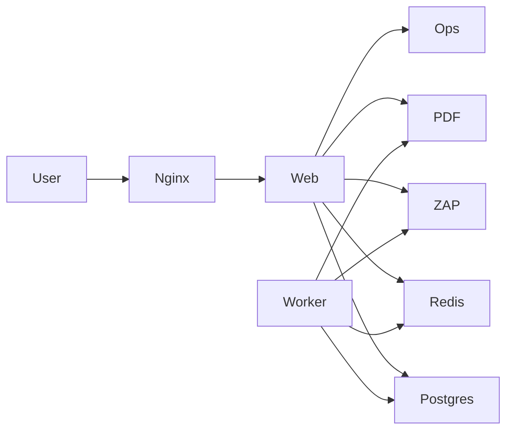
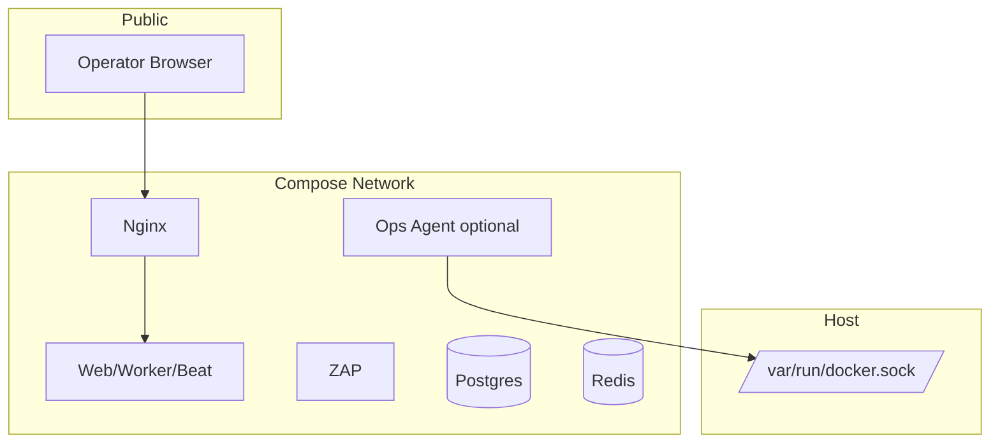
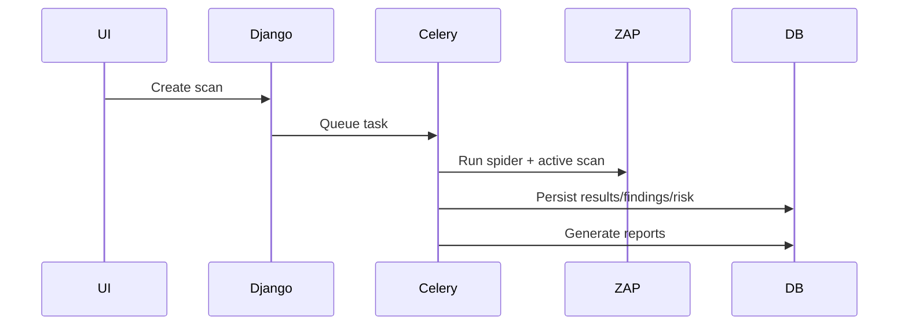

# ZapUI


## Documentation Changelog
- Date: 2026-02-24
- Added: Code-verified operational details, commands, and cross-links.
- Clarified: Security posture, runtime behavior, and service boundaries.
- Deprecated: None in this pass.
- Appendix: N/A (no original content removed).

ZapUI is a Dockerized OWASP ZAP control plane that helps teams run security scans, manage findings over time, score risk, and track scan-to-scan evolution from a single operational interface.

It is designed for practical deployment: one compose stack, guided first-run setup, optional privileged operations mode, and persistent reporting/analytics.

---

## 1) What this tool is

ZapUI is not only a scanner trigger UI. It is a lifecycle platform for:

- modeling applications as projects and targets/assets,
- running repeatable scans through reusable profiles,
- distributing scans across internal or external ZAP nodes,
- preserving raw scanner outputs and normalized findings,
- tracking risk snapshots and directional change over time,
- producing downloadable reports (HTML, JSON, PDF),
- operating services safely with explicit privileged boundaries.

---

## 2) Core concepts

### Project
Top-level ownership and grouping boundary (application, business domain, product line).

### Target / Asset
A concrete endpoint or service URL within a project that can be scanned.

### Zap Node
A ZAP API endpoint used to execute scans.

- `internal_managed`: created/scaled from compose service inventory.
- `external`: manually registered remote ZAP node.

### Scan Profile
Reusable scan strategy template (scan type, spider behavior, timeout, optional node pinning).

### Scan Job
A single scan execution instance linked to project, target, and profile.

### Findings
Normalized vulnerability records deduplicated by target/plugin/title and enriched with instances.

### Risk
Weighted severity scoring represented as snapshots at:

- target scope,
- project scope,
- global scope.

### Evolution
Comparison between consecutive completed scans for a target:

- newly introduced findings,
- resolved findings,
- risk delta.

---

## 3) Architecture overview

Main services in `docker-compose.yml`:

- `nginx`: ingress, TLS termination, setup-phase routing behavior,
- `web`: Django + Gunicorn application,
- `worker`: Celery async worker,
- `beat`: Celery scheduler,
- `db`: PostgreSQL,
- `redis`: broker/cache,
- `zap`: internal OWASP ZAP daemon,
- `pdf`: internal PDF renderer,
- `ops` (optional profile): privileged compose operations agent.

Runtime flow summary:

1. Users manage projects/targets/profiles.
2. Scan jobs are queued.
3. Worker executes ZAP API orchestration.
4. Raw alerts are stored.
5. Findings/risk/evolution models are updated.
6. Reports are generated.

For full details, see `docs/architecture.md`.

---

## 4) Installation guide

## Option A: Interactive installer (recommended)

```bash
bash scripts/install.sh
```

What installer supports:

- safe re-runs (idempotent workflow),
- clone or reuse existing checkout,
- optional `git pull --ff-only`,
- configurable public ports,
- optional Ops Agent enablement,
- optional rebuild with `docker compose build --pull`,
- re-apply configuration with `docker compose up -d --remove-orphans`,
- clear final status and endpoint output.

After installation, open:

- `http://localhost:<PUBLIC_HTTP_PORT>/setup`

## Option B: Manual install

1. Clone repository.
2. Copy `.env.example` to `.env` and set secure values.
3. Create runtime directories:
   - `certs/`
   - `nginx/state/`
   - `nginx/conf.d/`
4. Build and start:

```bash
docker compose build
docker compose up -d
```

5. Complete first-run setup at `/setup`.

---

## 5) Setup wizard summary

Wizard steps:

1. instance metadata + database mode,
   - **External base URL**: the public URL clients should use to access ZapUI. It is used for generated links, redirects, and certificate hostnames. The field is auto-prefilled from the current request host when possible.
   - **Display HTTP port (reference only)** and **Display HTTPS port (reference only)**: informational values shown in the UI and setup notes. They default to `PUBLIC_HTTP_PORT` and `PUBLIC_HTTPS_PORT` (from `install.sh` / `.env`) and do not change Docker or reverse-proxy port bindings by themselves.
2. initial admin account,
3. TLS mode (generate or validate provided certs),
4. internal ZAP pool size and optional external node test,
5. finalize and mark setup complete.

Wizard progress is persisted server-side and can resume across restarts/transitions.

---

## 6) Production notes

Recommended production posture:

- replace all default secrets immediately,
- use trusted TLS certificates,
- set strict `DJANGO_ALLOWED_HOSTS`,
- enforce least-privilege network exposure,
- monitor `web`, `worker`, `nginx`, and database logs,
- keep a validated backup + restore process,
- rehearse upgrade and rollback procedures.

---

## 7) Security notes

### Ops Agent

Ops Agent is disabled by default and should remain disabled unless required.

When enabled, it can trigger compose operations. Treat it as sensitive control-plane infrastructure.

### Docker socket warning

Ops Agent mounts `/var/run/docker.sock`; this is a high-privilege boundary and often equivalent to host-level control.

### Minimum hardening controls

- strong `OPS_AGENT_TOKEN`,
- restricted network path to ops service,
- minimal admin account footprint,
- regular credential rotation,
- audit review of privileged actions.

See `docs/security.md` for full guidance.

---

## 8) Troubleshooting

- **Unexpected redirects to setup**
  - verify `SetupState.is_complete` and `nginx/state/setup_complete` consistency.
- **Login issues**
  - verify setup completion and admin creation step.
- **Node connectivity failures**
  - validate base URL, API key, and network path to ZAP API.
- **Scan jobs stuck or failing**
  - inspect `worker`, `redis`, and `db` health/logs.
- **HTTPS failures**
  - verify `certs/fullchain.pem` and `certs/privkey.pem` presence/permissions.
- **Ops actions unavailable**
  - verify `ENABLE_OPS_AGENT=true`, `COMPOSE_PROFILES=ops`, and token alignment.

---

## 9) Backup and restore strategy

Back up these artifacts together:

- `db_data` (PostgreSQL state),
- `media_data` (reports and uploaded/generated media),
- `certs/` (TLS private key and certificate chain),
- `nginx/state/` (setup completion and runtime flags).

Recommended strategy:

- scheduled database dumps + volume snapshots,
- encrypted off-host backup storage,
- retention and integrity verification,
- periodic restore drills.

Restore runbook:

1. stop stack (`docker compose down`),
2. restore db/media/certs/nginx state,
3. start stack (`docker compose up -d`),
4. validate health/login/report access.

---

## 10) Upgrade strategy

1. take a full backup snapshot,
2. pull latest source (or use installer pull option),
3. rebuild and redeploy services,
4. verify migration logs and service health,
5. run smoke checks (login, node test, scan, reports, evolution),
6. roll back with backup restore if regression appears.

---

## 11) Documentation map

- `README.md` (this file): operator onboarding and lifecycle guidance.
- `docs/architecture.md`: detailed system architecture and flow.
- `docs/security.md`: security boundaries and hardening controls.
- `docs/operations.md`: day-0/day-2 runbook, backup/restore, upgrades.
- `docs/api.md`: endpoint inventory and integration surfaces.
- `scripts/README.md`: installer behavior and scenarios.
- `backend/zapcontrol/README.md`: backend internals and model logic.
- `nginx/README.md`: ingress/setup flag/TLS behavior.
- `docker/*/README.md`: image-level implementation notes.

---

## 2026 Documentation Enrichment

### Code-verified quick commands
```bash
# Validate compose configuration
docker compose config

# Show running services
docker compose ps

# Tail main application logs
docker compose logs -f --tail=200 web worker beat nginx
```

### Related docs
- Root entrypoint: `README.md`
- Canonical runtime facts: `docs/CODE_REALITY.md`
- Validation checklist: `docs/DOCS_QA_CHECKLIST.md`

No original content removed in this file.

## Architecture Diagram (Enriched)


## Trust Boundaries (Ops emphasis)


## Scan Lifecycle (High-level)

