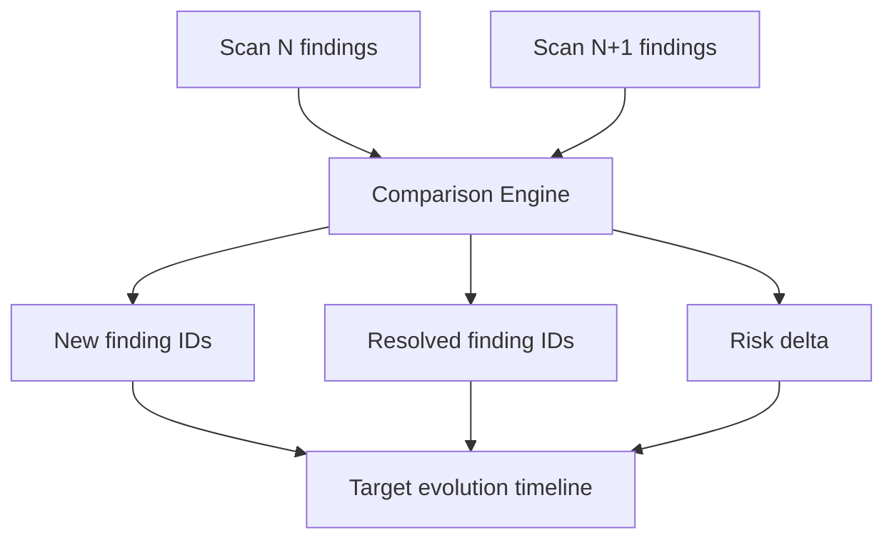

# Assets and Evolution

## Documentation Changelog
- Date: 2026-02-24
- Added: Asset/finding evolution and scan diff behavior.
- Clarified: New vs resolved finding computation.
- Deprecated: None.
- Appendix: N/A (new file).

## Diffing flow

## Operator path
- Open target detail: `/targets/<target_id>`.
- Open evolution chart: `/targets/<target_id>/evolution`.
- Open comparison details from timeline/cards.
