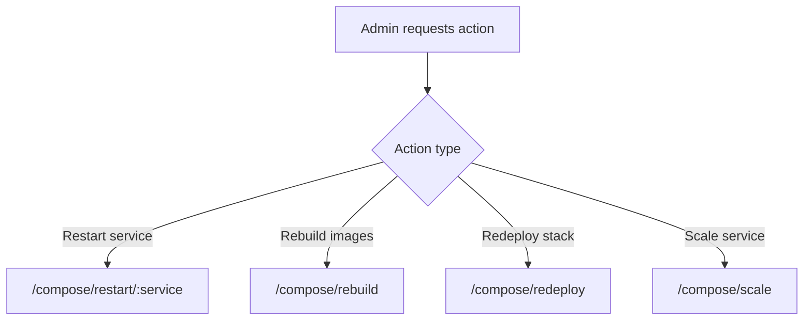
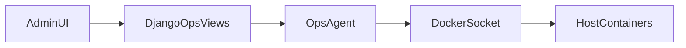

# Operations


## Documentation Changelog
- Date: 2026-02-24
- Added: Code-verified operational details, commands, and cross-links.
- Clarified: Security posture, runtime behavior, and service boundaries.
- Deprecated: None in this pass.
- Appendix: N/A (no original content removed).

This runbook covers deployment, day-2 operations, backup/restore, upgrades, and troubleshooting.

---

## 1) Day-0 deployment

Recommended path:

1. run `bash scripts/install.sh`,
2. complete setup wizard,
3. validate health, login, and scan workflow,
4. replace temporary certificates and default secrets,
5. document operational ownership.

Manual path is supported via compose commands but installer is preferred.

---

## 2) Installer behavior (idempotent operations)

`scripts/install.sh` supports safe re-runs for:

- initial install,
- pulling latest code,
- changing public ports,
- enabling/disabling ops profile,
- rebuilding images,
- re-applying compose state.

It updates key `.env` values and reconciles services using `docker compose up -d --remove-orphans`.

---

## 3) Standard day-2 workflows

- monitor `/ops/overview` (admin),
- manage nodes in `/zapnodes`,
- maintain profiles in `/profiles`,
- launch and monitor jobs in `/scans`,
- consume artifacts in `/reports`,
- analyze changes in target evolution pages.

---

## 4) Backup strategy

Critical assets:

- `db_data` volume,
- `media_data` volume,
- `certs/` directory,
- `nginx/state/` directory.

Recommended policy:

- scheduled DB dumps and volume snapshots,
- off-site encrypted storage,
- retention policy with integrity checks,
- restore drills on a regular cadence.

---

## 5) Restore strategy

1. stop services (`docker compose down`),
2. restore database and media artifacts,
3. restore cert material and nginx state,
4. start stack (`docker compose up -d`),
5. validate health/auth/report access and recent scan history.

---

## 6) Upgrade strategy

1. create verified backup snapshot,
2. pull latest source,
3. rebuild/redeploy stack,
4. verify startup logs and migrations,
5. run smoke tests,
6. rollback via backup if regression appears.

Smoke tests should include:

- `/health`,
- login,
- node connectivity test,
- sample scan completion,
- report download,
- evolution diff visibility.

---

## 7) Operational observability

At minimum monitor:

- service status (`docker compose ps`),
- container logs (`docker compose logs -f <service>`),
- failed scan rate,
- worker queue latency,
- DB connectivity and disk usage,
- certificate expiration windows.

---

## 8) Troubleshooting matrix

### Setup redirects never end

- verify setup state in DB,
- verify presence/consistency of `nginx/state/setup_complete`.

### External node tests fail

- verify node URL/API key,
- verify network reachability from `web` container.

### Jobs remain pending

- verify worker is running,
- verify Redis broker connectivity,
- inspect Celery logs for task errors.

### Report generation fails

- verify `pdf` service health and logs,
- inspect HTML payload and rendering options.

### Ops actions unavailable

- verify `ENABLE_OPS_AGENT=true`,
- verify `COMPOSE_PROFILES=ops`,
- verify token match between Django and ops service.

---

## 9) Emergency operations checklist

- preserve logs before restart cycles,
- avoid destructive operations without backups,
- rotate secrets if compromise is suspected,
- document incident timeline and remediation actions.

---

## 2026 Documentation Enrichment

### Code-verified quick commands
```bash
# Validate compose configuration
docker compose config

# Show running services
docker compose ps

# Tail main application logs
docker compose logs -f --tail=200 web worker beat nginx
```

### Related docs
- Root entrypoint: `README.md`
- Canonical runtime facts: `docs/CODE_REALITY.md`
- Validation checklist: `docs/DOCS_QA_CHECKLIST.md`

No original content removed in this file.

## Operations Workflows Diagram


## Trust Boundaries in Operations


## Practical runbook commands
```bash
# Restart web only
docker compose restart web

# Rebuild and redeploy
docker compose up -d --build

# Scale zap pool
docker compose up -d --scale zap=3 zap
```
