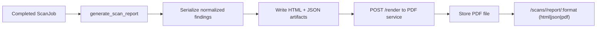

# Reporting Pipeline

## Documentation Changelog
- Date: 2026-02-24
- Added: Report generation and download flow.
- Clarified: HTML/JSON/PDF dependencies.
- Deprecated: None.
- Appendix: N/A (new file).

## Reporting flow


## Checks
```bash
docker compose logs -f --tail=200 pdf web
```
