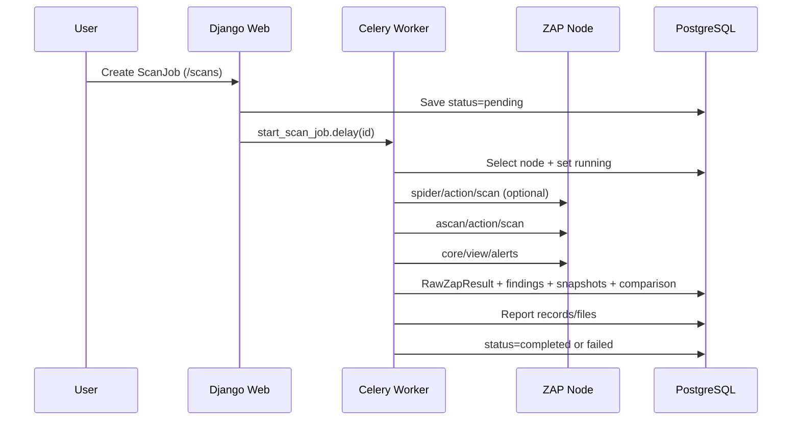

# Scanning Lifecycle

## Documentation Changelog
- Date: 2026-02-24
- Added: End-to-end transaction flow and failure states.
- Clarified: Node selection and profile behavior.
- Deprecated: None.
- Appendix: N/A (new file).

## Transaction sequence


## Practical checks
```bash
docker compose logs -f --tail=200 worker
```
